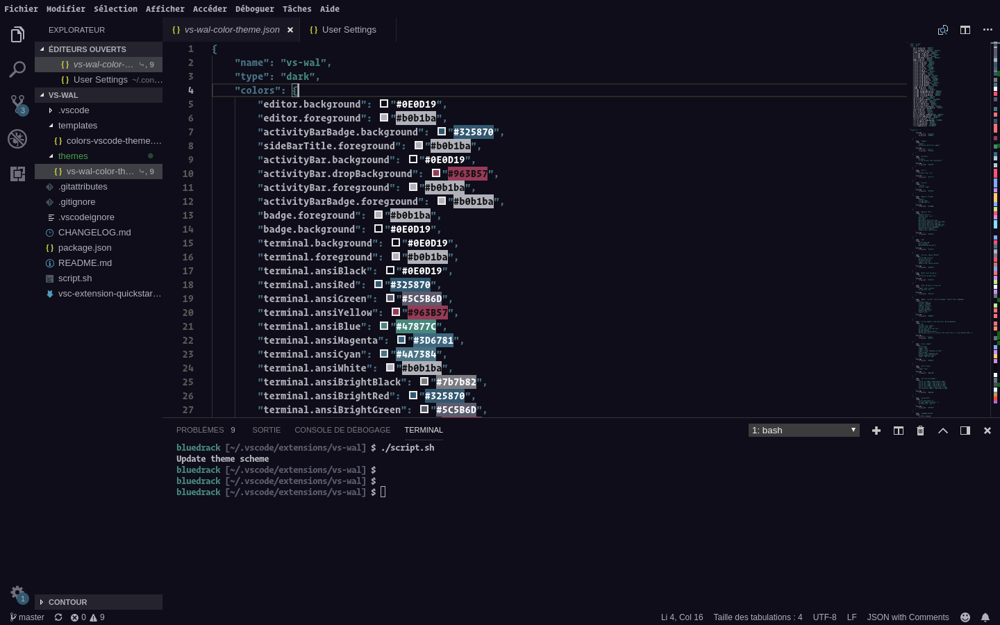

# A theme generator for Visual Studio Code compatible with pywal

# How to install the theme

1. Install [pywal](https://github.com/dylanaraps/pywal)
2. Download the repository with `git clone https://github.com/Bluedrack28/vscode-wal.git ~/.vscode/extensions/vscode-wal`
3. Go to the repository (`~/.vscode/extensions/vscode-wal`) and run `./script.sh` which will install the current template for vscode
4. Normally run `wal -R` and select the theme in vscode

# Screenshot

# **HELP ME!**

I do not have enough time to devote to this project. I need your help. If you have a little bit of time and a little programming skill, you can gladly make a pull request.
You can find documentation for vscode themes [here](https://code.visualstudio.com/docs/getstarted/theme-color-reference).
You can also share this project to other fans of pywal who maybe want to do something for the community. 
Thank you very much.

# CAUTION

Use this software very **carefully**, it is currently in **alpha**. I can't be held responsible for any possible bugs. 
